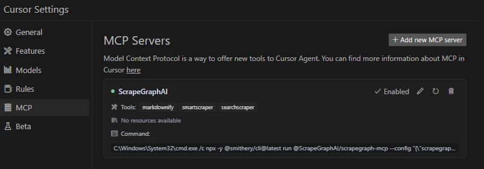

# ScrapeGraph MCP Server

[](https://smithery.ai/server/@ScrapeGraphAI/scrapegraph-mcp)
[](https://opensource.org/licenses/MIT)
[](https://www.python.org/downloads/)


A production-ready [Model Context Protocol](https://modelcontextprotocol.io/introduction) (MCP) server that provides seamless integration with the [ScrapeGraph AI](https://scrapegraphai.com) API. This server enables language models to leverage advanced AI-powered web scraping capabilities with enterprise-grade reliability.

## Table of Contents

- [Key Features](#key-features)
- [Quick Start](#quick-start)
- [Available Tools](#available-tools)
- [Setup Instructions](#setup-instructions)
- [Remote Server Usage](#remote-server-usage)
- [Local Usage](#local-usage)
- [Google ADK Integration](#google-adk-integration)
- [Example Use Cases](#example-use-cases)
- [Error Handling](#error-handling)
- [Common Issues](#common-issues)
- [Development](#development)
- [Contributing](#contributing)
- [Documentation](#documentation)
- [Technology Stack](#technology-stack)
- [License](#license)

## Key Features

- **8 Powerful Tools**: From simple markdown conversion to complex multi-page crawling and agentic workflows
- **AI-Powered Extraction**: Intelligently extract structured data using natural language prompts
- **Multi-Page Crawling**: SmartCrawler supports asynchronous crawling with configurable depth and page limits
- **Infinite Scroll Support**: Handle dynamic content loading with configurable scroll counts
- **JavaScript Rendering**: Full support for JavaScript-heavy websites
- **Flexible Output Formats**: Get results as markdown, structured JSON, or custom schemas
- **Easy Integration**: Works seamlessly with Claude Desktop, Cursor, and any MCP-compatible client
- **Enterprise-Ready**: Robust error handling, timeout management, and production-tested reliability
- **Simple Deployment**: One-command installation via Smithery or manual setup
- **Comprehensive Documentation**: Detailed developer docs in `.agent/` folder

## Quick Start

### 1. Get Your API Key

Sign up and get your API key from the [ScrapeGraph Dashboard](https://dashboard.scrapegraphai.com)

### 2. Install with Smithery (Recommended)

```bash
npx -y @smithery/cli install @ScrapeGraphAI/scrapegraph-mcp --client claude
```

### 3. Start Using

Ask Claude or Cursor:
- "Convert https://scrapegraphai.com to markdown"
- "Extract all product prices from this e-commerce page"
- "Research the latest AI developments and summarize findings"

That's it! The server is now available to your AI assistant.

## Available Tools

The server provides **8 enterprise-ready tools** for AI-powered web scraping:

### Core Scraping Tools

#### 1. `markdownify`
Transform any webpage into clean, structured markdown format.

```python
markdownify(website_url: str)
```
- **Credits**: 2 per request
- **Use case**: Quick webpage content extraction in markdown

#### 2. `smartscraper`
Leverage AI to extract structured data from any webpage with support for infinite scrolling.

```python
smartscraper(
    user_prompt: str,
    website_url: str,
    number_of_scrolls: int = None,
    markdown_only: bool = None
)
```
- **Credits**: 10+ (base) + variable based on scrolling
- **Use case**: AI-powered data extraction with custom prompts

#### 3. `searchscraper`
Execute AI-powered web searches with structured, actionable results.

```python
searchscraper(
    user_prompt: str,
    num_results: int = None,
    number_of_scrolls: int = None
)
```
- **Credits**: Variable (3-20 websites × 10 credits)
- **Use case**: Multi-source research and data aggregation

### Advanced Scraping Tools

#### 4. `scrape`
Basic scraping endpoint to fetch page content with optional heavy JavaScript rendering.

```python
scrape(website_url: str, render_heavy_js: bool = None)
```
- **Use case**: Simple page content fetching with JS rendering support

#### 5. `sitemap`
Extract sitemap URLs and structure for any website.

```python
sitemap(website_url: str)
```
- **Use case**: Website structure analysis and URL discovery

### Multi-Page Crawling

#### 6. `smartcrawler_initiate`
Initiate intelligent multi-page web crawling (asynchronous operation).

```python
smartcrawler_initiate(
    url: str,
    prompt: str = None,
    extraction_mode: str = "ai",
    depth: int = None,
    max_pages: int = None,
    same_domain_only: bool = None
)
```
- **AI Extraction Mode**: 10 credits per page - extracts structured data
- **Markdown Mode**: 2 credits per page - converts to markdown
- **Returns**: `request_id` for polling
- **Use case**: Large-scale website crawling and data extraction

#### 7. `smartcrawler_fetch_results`
Retrieve results from asynchronous crawling operations.

```python
smartcrawler_fetch_results(request_id: str)
```
- **Returns**: Status and results when crawling is complete
- **Use case**: Poll for crawl completion and retrieve results

### Intelligent Agent-Based Scraping

#### 8. `agentic_scrapper`
Run advanced agentic scraping workflows with customizable steps and structured output schemas.

```python
agentic_scrapper(
    url: str,
    user_prompt: str = None,
    output_schema: dict = None,
    steps: list = None,
    ai_extraction: bool = None,
    persistent_session: bool = None,
    timeout_seconds: float = None
)
```
- **Use case**: Complex multi-step workflows with custom schemas and persistent sessions

## Setup Instructions

To utilize this server, you'll need a ScrapeGraph API key. Follow these steps to obtain one:

1. Navigate to the [ScrapeGraph Dashboard](https://dashboard.scrapegraphai.com)
2. Create an account and generate your API key

### Automated Installation via Smithery

For automated installation of the ScrapeGraph API Integration Server using [Smithery](https://smithery.ai/server/@ScrapeGraphAI/scrapegraph-mcp):

```bash
npx -y @smithery/cli install @ScrapeGraphAI/scrapegraph-mcp --client claude
```

### Claude Desktop Configuration

Update your Claude Desktop configuration file with the following settings (located on the top rigth of the Cursor page):

(remember to add your API key inside the config)

```json
{
    "mcpServers": {
        "@ScrapeGraphAI-scrapegraph-mcp": {
            "command": "npx",
            "args": [
                "-y",
                "@smithery/cli@latest",
                "run",
                "@ScrapeGraphAI/scrapegraph-mcp",
                "--config",
                "\"{\\\"scrapegraphApiKey\\\":\\\"YOUR-SGAI-API-KEY\\\"}\""
            ]
        }
    }
}
```

The configuration file is located at:
- Windows: `%APPDATA%/Claude/claude_desktop_config.json`
- macOS: `~/Library/Application\ Support/Claude/claude_desktop_config.json`

### Cursor Integration

Add the ScrapeGraphAI MCP server on the settings:



## Remote Server Usage

Connect to our hosted MCP server - no local installation required!

### Claude Desktop Configuration (Remote)

Add this to your Claude Desktop config (`~/Library/Application Support/Claude/claude_desktop_config.json` on macOS):

```json
{
  "mcpServers": {
    "scrapegraph-mcp": {
      "command": "npx",
      "args": [
        "mcp-remote@0.1.25",
        "https://scrapegraph-mcp.onrender.com/mcp",
        "--header",
        "X-API-Key:YOUR_API_KEY"
      ]
    }
  }
}
```

### Cursor Configuration (Remote)

Cursor supports native HTTP MCP connections. Add to your Cursor MCP settings (`~/.cursor/mcp.json`):

```json
{
  "mcpServers": {
    "scrapegraph-mcp": {
      "url": "https://scrapegraph-mcp.onrender.com/mcp",
      "headers": {
        "X-API-Key": "YOUR_API_KEY"
      }
    }
  }
}
```

### Benefits of Remote Server

- **No local setup** - Just configure and start using
- **Always up-to-date** - Automatically receives latest updates
- **Cross-platform** - Works on any OS with Node.js

## Local Usage

To run the MCP server locally for development or testing, follow these steps:

### Prerequisites

- Python 3.13 or higher
- pip or uv package manager
- ScrapeGraph API key

### Installation

1. **Clone the repository** (if you haven't already):

```bash
git clone https://github.com/ScrapeGraphAI/scrapegraph-mcp
cd scrapegraph-mcp
```

2. **Install the package**:

```bash
# Using pip
pip install -e .

# Or using uv (faster)
uv pip install -e .
```

3. **Set your API key**:

```bash
# macOS/Linux
export SGAI_API_KEY=your-api-key-here

# Windows (PowerShell)
$env:SGAI_API_KEY="your-api-key-here"

# Windows (CMD)
set SGAI_API_KEY=your-api-key-here
```

### Running the Server Locally

You can run the server directly:

```bash
# Using the installed command
scrapegraph-mcp

# Or using Python module
python -m scrapegraph_mcp.server
```

The server will start and communicate via stdio (standard input/output), which is the standard MCP transport method.

### Testing with MCP Inspector

Test your local server using the MCP Inspector tool:

```bash
npx @modelcontextprotocol/inspector python -m scrapegraph_mcp.server
```

This provides a web interface to test all available tools interactively.

### Configuring Claude Desktop for Local Server

To use your locally running server with Claude Desktop, update your configuration file:

**macOS/Linux** (`~/Library/Application Support/Claude/claude_desktop_config.json`):

```json
{
    "mcpServers": {
        "scrapegraph-mcp-local": {
            "command": "python",
            "args": [
                "-m",
                "scrapegraph_mcp.server"
            ],
            "env": {
                "SGAI_API_KEY": "your-api-key-here"
            }
        }
    }
}
```

**Windows** (`%APPDATA%\Claude\claude_desktop_config.json`):

```json
{
    "mcpServers": {
        "scrapegraph-mcp-local": {
            "command": "python",
            "args": [
                "-m",
                "scrapegraph_mcp.server"
            ],
            "env": {
                "SGAI_API_KEY": "your-api-key-here"
            }
        }
    }
}
```

**Note**: Make sure Python is in your PATH. You can verify by running `python --version` in your terminal.

### Configuring Cursor for Local Server

In Cursor's MCP settings, add a new server with:

- **Command**: `python`
- **Args**: `["-m", "scrapegraph_mcp.server"]`
- **Environment Variables**: `{"SGAI_API_KEY": "your-api-key-here"}`

### Troubleshooting Local Setup

**Server not starting:**
- Verify Python is installed: `python --version`
- Check that the package is installed: `pip list | grep scrapegraph-mcp`
- Ensure API key is set: `echo $SGAI_API_KEY` (macOS/Linux) or `echo %SGAI_API_KEY%` (Windows)

**Tools not appearing:**
- Check Claude Desktop logs:
  - macOS: `~/Library/Logs/Claude/`
  - Windows: `%APPDATA%\Claude\Logs\`
- Verify the server starts without errors when run directly
- Check that the configuration JSON is valid

**Import errors:**
- Reinstall the package: `pip install -e . --force-reinstall`
- Verify dependencies: `pip install -r requirements.txt` (if available)

## Google ADK Integration

The ScrapeGraph MCP server can be integrated with [Google ADK (Agent Development Kit)](https://github.com/google/adk) to create AI agents with web scraping capabilities.

### Prerequisites

- Python 3.13 or higher
- Google ADK installed
- ScrapeGraph API key

### Installation

1. **Install Google ADK** (if not already installed):

```bash
pip install google-adk
```

2. **Set your API key**:

```bash
export SGAI_API_KEY=your-api-key-here
```

### Basic Integration Example

Create an agent file (e.g., `agent.py`) with the following configuration:

```python
import os
from google.adk.agents import LlmAgent
from google.adk.tools.mcp_tool.mcp_toolset import MCPToolset
from google.adk.tools.mcp_tool.mcp_session_manager import StdioConnectionParams
from mcp import StdioServerParameters

# Path to the scrapegraph-mcp server directory
SCRAPEGRAPH_MCP_PATH = "/path/to/scrapegraph-mcp"

# Path to the server.py file
SERVER_SCRIPT_PATH = os.path.join(
    SCRAPEGRAPH_MCP_PATH, 
    "src", 
    "scrapegraph_mcp", 
    "server.py"
)

root_agent = LlmAgent(
    model='gemini-2.0-flash',
    name='scrapegraph_assistant_agent',
    instruction='Help the user with web scraping and data extraction using ScrapeGraph AI. '
                'You can convert webpages to markdown, extract structured data using AI, '
                'perform web searches, crawl multiple pages, and automate complex scraping workflows.',
    tools=[
        MCPToolset(
            connection_params=StdioConnectionParams(
                server_params=StdioServerParameters(
                    command='python3',
                    args=[
                        SERVER_SCRIPT_PATH,
                    ],
                    env={
                        'SGAI_API_KEY': os.getenv('SGAI_API_KEY'),
                    },
                ),
                timeout=300.0,)
            ),
            # Optional: Filter which tools from the MCP server are exposed
            # tool_filter=['markdownify', 'smartscraper', 'searchscraper']
        )
    ],
)
```

### Configuration Options

**Timeout Settings:**
- Default timeout is 5 seconds, which may be too short for web scraping operations
- Recommended: Set `timeout=300.0
- Adjust based on your use case (crawling operations may need even longer timeouts)

**Tool Filtering:**
- By default, all 8 tools are exposed to the agent
- Use `tool_filter` to limit which tools are available:
  ```python
  tool_filter=['markdownify', 'smartscraper', 'searchscraper']
  ```

**API Key Configuration:**
- Set via environment variable: `export SGAI_API_KEY=your-key`
- Or pass directly in `env` dict: `'SGAI_API_KEY': 'your-key-here'`
- Environment variable approach is recommended for security

### Usage Example

Once configured, your agent can use natural language to interact with web scraping tools:

```python
# The agent can now handle queries like:
# - "Convert https://example.com to markdown"
# - "Extract all product prices from this e-commerce page"
# - "Search for recent AI research papers and summarize them"
# - "Crawl this documentation site and extract all API endpoints"
```
For more information about Google ADK, visit the [official documentation](https://github.com/google/adk).

## Example Use Cases

The server enables sophisticated queries across various scraping scenarios:

### Single Page Scraping
- **Markdownify**: "Convert the ScrapeGraph documentation page to markdown"
- **SmartScraper**: "Extract all product names, prices, and ratings from this e-commerce page"
- **SmartScraper with scrolling**: "Scrape this infinite scroll page with 5 scrolls and extract all items"
- **Basic Scrape**: "Fetch the HTML content of this JavaScript-heavy page with full rendering"

### Search and Research
- **SearchScraper**: "Research and summarize recent developments in AI-powered web scraping"
- **SearchScraper**: "Search for the top 5 articles about machine learning frameworks and extract key insights"
- **SearchScraper**: "Find recent news about GPT-4 and provide a structured summary"

### Website Analysis
- **Sitemap**: "Extract the complete sitemap structure from the ScrapeGraph website"
- **Sitemap**: "Discover all URLs on this blog site"

### Multi-Page Crawling
- **SmartCrawler (AI mode)**: "Crawl the entire documentation site and extract all API endpoints with descriptions"
- **SmartCrawler (Markdown mode)**: "Convert all pages in the blog to markdown up to 2 levels deep"
- **SmartCrawler**: "Extract all product information from an e-commerce site, maximum 100 pages, same domain only"

### Advanced Agentic Scraping
- **Agentic Scraper**: "Navigate through a multi-step authentication form and extract user dashboard data"
- **Agentic Scraper with schema**: "Follow pagination links and compile a dataset with schema: {title, author, date, content}"
- **Agentic Scraper**: "Execute a complex workflow: login, navigate to reports, download data, and extract summary statistics"

## Error Handling

The server implements robust error handling with detailed, actionable error messages for:

- API authentication issues
- Malformed URL structures
- Network connectivity failures
- Rate limiting and quota management

## Common Issues

### Windows-Specific Connection

When running on Windows systems, you may need to use the following command to connect to the MCP server:

```bash
C:\Windows\System32\cmd.exe /c npx -y @smithery/cli@latest run @ScrapeGraphAI/scrapegraph-mcp --config "{\"scrapegraphApiKey\":\"YOUR-SGAI-API-KEY\"}"
```

This ensures proper execution in the Windows environment.

### Other Common Issues

**"ScrapeGraph client not initialized"**
- **Cause**: Missing API key
- **Solution**: Set `SGAI_API_KEY` environment variable or provide via `--config`

**"Error 401: Unauthorized"**
- **Cause**: Invalid API key
- **Solution**: Verify your API key at the [ScrapeGraph Dashboard](https://dashboard.scrapegraphai.com)

**"Error 402: Payment Required"**
- **Cause**: Insufficient credits
- **Solution**: Add credits to your ScrapeGraph account

**SmartCrawler not returning results**
- **Cause**: Still processing (asynchronous operation)
- **Solution**: Keep polling `smartcrawler_fetch_results()` until status is "completed"

**Tools not appearing in Claude Desktop**
- **Cause**: Server not starting or configuration error
- **Solution**: Check Claude logs at `~/Library/Logs/Claude/` (macOS) or `%APPDATA%\Claude\Logs\` (Windows)

For detailed troubleshooting, see the [.agent documentation](.agent/README.md).

## Development

### Prerequisites

- Python 3.13 or higher
- pip or uv package manager
- ScrapeGraph API key

### Installation from Source

```bash
# Clone the repository
git clone https://github.com/ScrapeGraphAI/scrapegraph-mcp
cd scrapegraph-mcp

# Install dependencies
pip install -e ".[dev]"

# Set your API key
export SGAI_API_KEY=your-api-key

# Run the server
scrapegraph-mcp
# or
python -m scrapegraph_mcp.server
```

### Testing with MCP Inspector

Test your server locally using the MCP Inspector tool:

```bash
npx @modelcontextprotocol/inspector scrapegraph-mcp
```

This provides a web interface to test all available tools.

### Code Quality

**Linting:**
```bash
ruff check src/
```

**Type Checking:**
```bash
mypy src/
```

**Format Checking:**
```bash
ruff format --check src/
```

### Project Structure

```
scrapegraph-mcp/
├── src/
│   └── scrapegraph_mcp/
│       ├── __init__.py      # Package initialization
│       └── server.py        # Main MCP server (all code in one file)
├── .agent/                  # Developer documentation
│   ├── README.md           # Documentation index
│   └── system/             # System architecture docs
├── assets/                  # Images and badges
├── pyproject.toml          # Project metadata & dependencies
├── smithery.yaml           # Smithery deployment config
└── README.md               # This file
```

## Contributing

We welcome contributions! Here's how you can help:

### Adding a New Tool

1. **Add method to `ScapeGraphClient` class** in [server.py](src/scrapegraph_mcp/server.py):

```python
def new_tool(self, param: str) -> Dict[str, Any]:
    """Tool description."""
    url = f"{self.BASE_URL}/new-endpoint"
    data = {"param": param}
    response = self.client.post(url, headers=self.headers, json=data)
    if response.status_code != 200:
        raise Exception(f"Error {response.status_code}: {response.text}")
    return response.json()
```

2. **Add MCP tool decorator**:

```python
@mcp.tool()
def new_tool(param: str) -> Dict[str, Any]:
    """
    Tool description for AI assistants.

    Args:
        param: Parameter description

    Returns:
        Dictionary containing results
    """
    if scrapegraph_client is None:
        return {"error": "ScrapeGraph client not initialized. Please provide an API key."}

    try:
        return scrapegraph_client.new_tool(param)
    except Exception as e:
        return {"error": str(e)}
```

3. **Test with MCP Inspector**:
```bash
npx @modelcontextprotocol/inspector scrapegraph-mcp
```

4. **Update documentation**:
   - Add tool to this README
   - Update [.agent documentation](.agent/README.md)

5. **Submit a pull request**

### Development Workflow

1. Fork the repository
2. Create a feature branch (`git checkout -b feature/amazing-feature`)
3. Make your changes
4. Run linting and type checking
5. Test with MCP Inspector and Claude Desktop
6. Update documentation
7. Commit your changes (`git commit -m 'Add amazing feature'`)
8. Push to the branch (`git push origin feature/amazing-feature`)
9. Open a Pull Request

### Code Style

- **Line length**: 100 characters
- **Type hints**: Required for all functions
- **Docstrings**: Google-style docstrings
- **Error handling**: Return error dicts, don't raise exceptions in tools
- **Python version**: Target 3.13+

For detailed development guidelines, see the [.agent documentation](.agent/README.md).

## Documentation

For comprehensive developer documentation, see:

- **[.agent/README.md](.agent/README.md)** - Complete developer documentation index
- **[.agent/system/project_architecture.md](.agent/system/project_architecture.md)** - System architecture and design
- **[.agent/system/mcp_protocol.md](.agent/system/mcp_protocol.md)** - MCP protocol integration details

## Technology Stack

### Core Framework
- **Python 3.13+** - Modern Python with type hints
- **FastMCP** - Lightweight MCP server framework
- **httpx 0.24.0+** - Modern async HTTP client

### Development Tools
- **Ruff** - Fast Python linter and formatter
- **mypy** - Static type checker
- **Hatchling** - Modern build backend

### Deployment
- **Smithery** - Automated MCP server deployment
- **Docker** - Container support with Alpine Linux
- **stdio transport** - Standard MCP communication

### API Integration
- **ScrapeGraph AI API** - Enterprise web scraping service
- **Base URL**: `https://api.scrapegraphai.com/v1`
- **Authentication**: API key-based

## License

This project is distributed under the MIT License. For detailed terms and conditions, please refer to the LICENSE file.

## Acknowledgments

Special thanks to [tomekkorbak](https://github.com/tomekkorbak) for his implementation of [oura-mcp-server](https://github.com/tomekkorbak/oura-mcp-server), which served as starting point for this repo.

## Resources

### Official Links
- [ScrapeGraph AI Homepage](https://scrapegraphai.com)
- [ScrapeGraph Dashboard](https://dashboard.scrapegraphai.com) - Get your API key
- [ScrapeGraph API Documentation](https://api.scrapegraphai.com/docs)
- [GitHub Repository](https://github.com/ScrapeGraphAI/scrapegraph-mcp)

### MCP Resources
- [Model Context Protocol](https://modelcontextprotocol.io/) - Official MCP specification
- [FastMCP Framework](https://github.com/jlowin/fastmcp) - Framework used by this server
- [MCP Inspector](https://github.com/modelcontextprotocol/inspector) - Testing tool
- [Smithery](https://smithery.ai/server/@ScrapeGraphAI/scrapegraph-mcp) - MCP server distribution
- mcp-name: io.github.ScrapeGraphAI/scrapegraph-mcp

### AI Assistant Integration
- [Claude Desktop](https://claude.ai/desktop) - Desktop app with MCP support
- [Cursor](https://cursor.sh/) - AI-powered code editor

### Support
- [GitHub Issues](https://github.com/ScrapeGraphAI/scrapegraph-mcp/issues) - Report bugs or request features
- [Developer Documentation](.agent/README.md) - Comprehensive dev docs

---

Made with ❤️ by [ScrapeGraphAI](https://scrapegraphai.com) Team